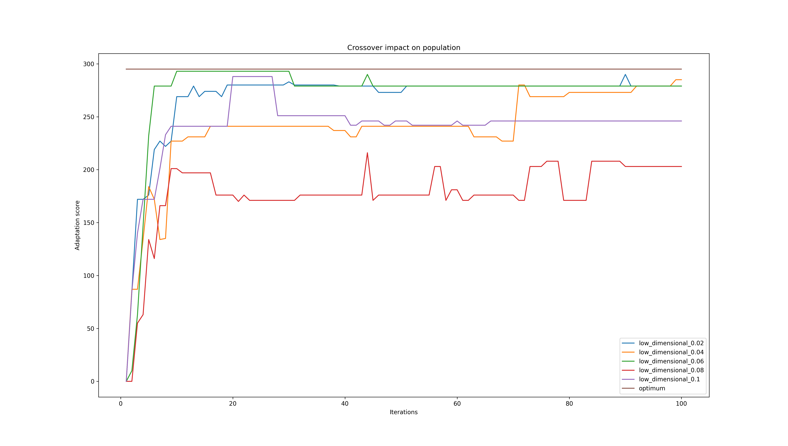
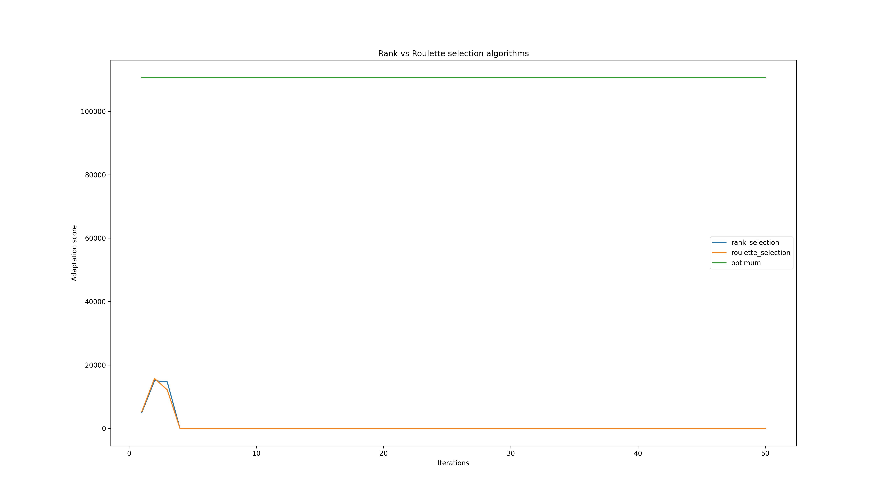
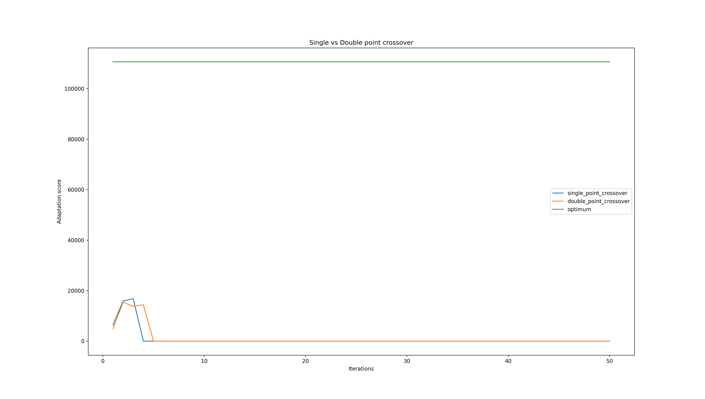
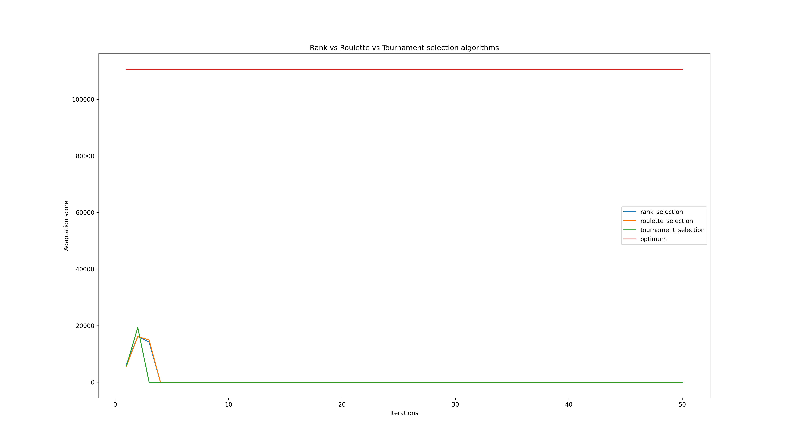

# Genetic algorithm course realizatoin
## Idea
Program created for the course "Genetic algorithms" covers base structure of genetic algorithms scheme, providing flexible environment to experiment with.\
Script covers topics like population generation, mutation, single and double point crossover on candidates and 3 basic selection functions: roulette, rank and tournament.

## Usage
The script can be executed in 2 modes:
* `normal_run` - user can freely select parameters for the simulation
* `example_run` - predefined set of simulations based on input data files included in the project presenting capabilities of the program

Starting the script is as simple as running: `./run.py` with chosen set of arguments.
### Normal run
In order to fully customize the simulation you should choose `normal_run` option for the execution.

Parameters available for customization:
* `-i, --input` - Path to input file with data to be loaded. Can be either relative or absolute path.
* `-s, --population-size` - Size of the population to be generated and later simulated.
* `-n, --iterations` - Number of iterations or steps that the population will go through. Each step consists of calculation phase to determine candidate with highest fitness, and genetic modification step.
* `-a, --selection-function` - Selection function to be used for creation of new population. Available functions: `ROULETTE, TOURNAMENT, RANK`
* `-c, --crossover-probability` - Crossover chance for each candidate during genetic modification step. Must be between 0.0 and 1.0.
* `-m, --mutation-probability` - Mutation chance for each separate gene of the candidate, evaluated during genetic modification step. Must be between 0.0 and 1.0.
* `-d, --double-point-crossover` - Changes algorithm used by crossover function from single point to double point crossover.

Example usage: `./run.py run_normal -i data/my_input_file.txt -s 1000 -n 500 -a RANK -c 0.1 -m 0.01` 

### Example run
Example dataset has been prepared with multiple simulation tests to show capabilities of the script and behavior of genetic algorithms implemented.\
Repository comes with predefined set of data available under `data/` directory.\
Each set of tests generates plot as an output, results are also available in the repository under `example/output` directory.\
\
If you want to generate such output yourself, you can execute `example run` by running: `./run.py run_example`

## Results analysis
### Configurations of simulations executed
### Mutation and crossover probability impact
#### Mutation results
`Low-Dimensional-Data`

\
Test was done using 5 values for mutation probability: 2%, 4%, 6%, 8% and 10%.\
The most significant difference visible is that lower probability chance yields more stable results over time. Each variant with mutation probability equal or higher than 6% show high variance of results, thus lowering average score for all generations.\
`High-Dimensional-Data`

\
Similar results can be seen in large scale datasets. The form is slightly different due to very strict constrain on total backpack size resulting in extremely fast degradation of candidates fitness.\
For 8% and 10% mutation probability, second iteration already brought highest score to 0 which stayed for the rest of simulation.\
6% and 4% runs were slightly better, 0 fitness level was achieved after 4th and 6th iteration respectively.\
Last mutation probability candidate - 2%, yield completely different results. Instead of degrading the score it actually improves it with each iteration reaching close to 6500 fitness score mark.
#### Crossover results
`Low-Dimensional-Data`

At first glance, crossover modification impact is not as extreme as mutation. Probabilities for mutation were exactly the same as for the mutation.
Each run comes with very similar results which are stable, but vary in the overall level.
Lower crossover chance allows to reach highest possible score with ease, which is kept till the end of simulation.\
For higher crossover chances, maximum score goes down by up to 10% being most significant with 10% crossover chance. \
`High-Dimensional-Data`

\
Large scale dataset doesn't confirm observation from smaller size datasets.\
Looking at 4% crossover chance, we notice that even though it start strong being in the middle of all simulations, after 5th iteration overall score becomes the lowest among all simulations.\
Results seem to be more or less random which is very different from low dataset tests. 
### Rank and roulette selection function comparison
`Low-Dimensional-Data`

\
For small size datasets there's no visible difference. As visible above, both algorithms are pretty much equal in terms finding optimal solution.\
The only strong difference is visible in still small, but bigger size dataset as below:

\
The theory is that on bigger datasets, rank selection should yield better overall and highest adaptation score. Next paragraph should confirm or deny the thesis.\
`High-Dimensional-Data`

\
As visible above, theory is not correct. Roulette selection algorithm not only reaches higher best score, but allows improvement on fitness score throughout the simulation.\
Rank selection on the other hand shows slight improvement for first 3 iterations, only to be completely destroyed by each consecutive iteration getting close to it's all time low on 10th iteration.
### Single and double point crossover comparison
`Low-Dimensional-Data`

\
With small sample size it's hard to determine whether single or double point crossover algorithm yields better results. The only observation that is worth noticing is that double point crossover has smaller steps in terms of highest fitness level throughout the simulation. \
Single point crossover is more aggressive and risky - it seems that we are facing a high risk, high reward type of approach.\
`High-Dimensional-Data`

\
This time, we can see slight domination of single point crossover over double point. Theory from previous tests seems to be somewhat true as increases between each iteration are vastly more significant for single point crossover. In this case, single point crossover is a clear winner achieving higher fitness level throughout the iteration.

\
As a finishing note, as the name implies - high risk, high reward can impact the population so bad, that it can have very difficult time recovering from such occurrence. The case presented above shows that 5th iteration decreased highest fitness score.\
Additionally, population was not able to achieve significant increase over remaining 5 iterations, closing the simulation at very similar level to iteration 4.
### Rank, roulette and tournament selection function comparison
`Low-Dimensional-Data`
\
In addition to already analysed rank and roulette algorithm we can take a look at tournament selection method. Low size datasets yield very similar results to rank selection. Fitness score is kept on stable and high level throughout the simulation. Again, only roulette selection algorithm acts very different having high variance from the beginning till the end of run.\
`High-Dimensional-Data`

\
Surprisingly, tournament selection method seems to be crafted just for large scale datasets. First of all, the algorithm was able to achieve highest score out of all 3. Additionally, fitness score noted significant improvement with almost every iteration excluding 6th.\
Tournament selection algorithm behavior is based on selection of the best candidate among selected subgroup. With this idea in mind, behavior observed on the plot should not be as surprising anymore.
